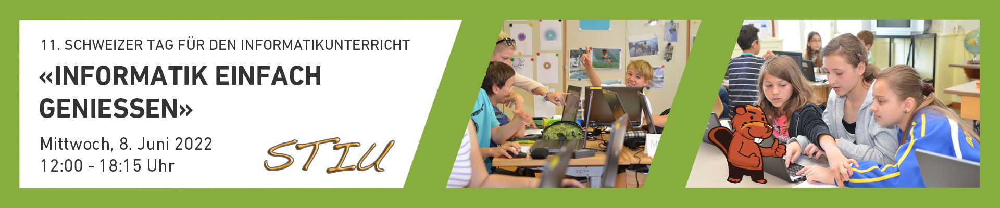

# [ABZ_Algorithms](https://www.abz.inf.ethz.ch/schweizer-tag-fur-den-informatikunterricht/stiu-2022/)

 

input image, aligned reconstruction, animation with various poses & expressions

 
  
Mit dem Schweizer Tag für den Informatikunterricht bieten wir Informatik-, Mathematik- und Physiklehrpersonen sowie Lehrpersonen der Volksschule eine Möglichkeit, in direktem Austausch mit Forschenden und Didaktikerinnen und Didaktikern neue Impulse und spannende Konzepte für ihren Informatikunterricht zu erhalten. Dabei können Sie sich direkt und unkompliziert über neue Inhalte im Fach Informatik informieren – und diese selbst ganz praktisch in Workshops ausprobieren.

Mit jeweils rund 130 Teilnehmenden von Schulen aus der Deutschschweiz und dem Tessin waren die neun bisher durchgeführten Schweizer Tage für den Informatikunterricht (STIU) ein voller Erfolg. In diversen Workshops konnten sich Informatiklehrpersonen Inspirationen und praktische Tipps für ihren Informatikunterricht holen.

STIU-1  Unplugged Gruppenaktivitäten zum Algorithmischen Denken

STIU-2  Einfach Robotik

STIU-3  Künstliche Intelligenz (KI) macht Schule - KI verstehen, begreifen und anwenden

STIU-4  Designen, Programmieren, Sticken - Kreatives Gestalten von digitalen Mustern

STIU-5  Algovision

STIU-6  Die Unterrichtsmethode «Flipped eduScrum» am Beispiel des geheimen Schlüsselaustausches erklärt

STIU-7  Algorithmik mit Python für Zyklus 3 und Gymnasium

STIU-8  Projekt-orientiertes Vermitteln von künstlicher Intelligenz

STIU-9  Programmieren und Wettbewerbe in Logo von der 1. bis zur 4. Klasse

STIU-10 Künstliche Intelligenz im gymnasialen Unterrich

STIU-11 Informatik-Magie mit den Mini-Oxocards erleben

STIU-12  Begleiteter Besuch der Ausstellung Abenteuer Informatik
